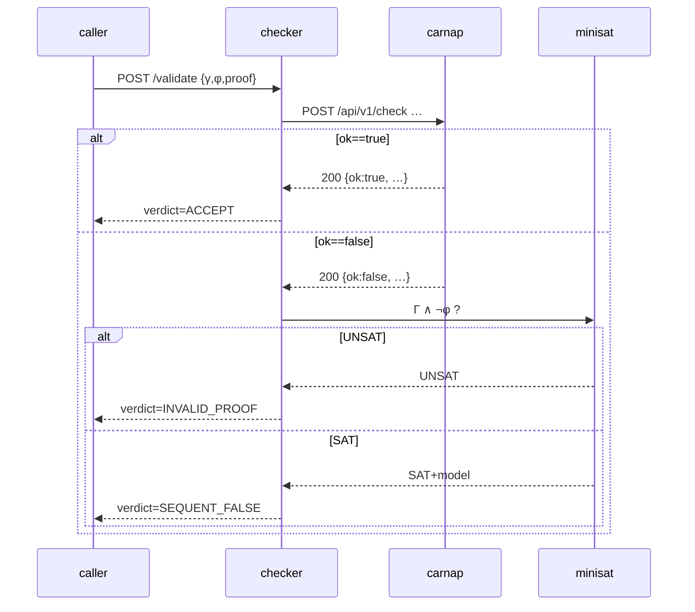

**Planning API integration**

The user has asked for a section covering how to implement the Carnap API. I'll include everything related to setup, containerization, and the specific components of the system. I also need to cover expected data formats (like proofs), compilation steps (compiling binaries and running servers), how to interact with the API (HTTP methods, request/response structure), and address error handling, timeouts, etc. I’ll look up the most current information and example code snippets to help out!


**Planning Carnap API integration**

The user needs a section on how to integrate the Carnap API. I’ll cover everything from setting up and containerizing Carnap, to explaining which components and endpoints to use. I also need to describe the expected data formats, compilation steps, how to make API calls, and considerations for proof systems. Error handling, scaling, and rate limiting are important, too. I’ll gather the latest info from web sources and provide an example code snippet to make it clearer.


**Gathering data on Carnap API**

I need to search for more details on the Carnap proof checker API and related resources, like its Haskell-based nature and how to compile it into JavaScript. I can use the Carnap GitHub repo to look for readme files and any endpoints mentioned. I'll focus on building the Carnap server, especially using Nix for containerization. I'll also explore available endpoints like "/api/check" or "/api/v1/check" and cite relevant sources for a more complete section.

**Digging into Carnap API docs**

I'll check out the Carnap API docs, searching toward the end for endpoints like "/proofs/validation" or "/api/v1/proofs/check". The docs I’ve found are more about documents, not proof checking directly. Still, the Carnap about page suggests that JSON APIs are available for proof checking. We might have to rely on demonstrating how to compile Carnap to JavaScript to use it in the browser, or work with Carnap's LTI server to check proofs more easily.


**Exploring Carnap API docs**

I’m diving into the Carnap API docs and scrolling to find endpoints like "proofs/validation" or proof-checking ones. Although the docs I found seem focused more on documents than proof-checking, the Carnap about page suggests a JSON API for that. We could either demonstrate compiling Carnap to JavaScript to run in the browser or use an offline container. Running Carnap’s LTI server and calling endpoints like "/api/v1/proofs/check" might be an easier approach.

**Setting up Carnap API**

To integrate the Carnap API for proof-checking, I’m considering two options. First, we could use a containerized Carnap server built via Nix or Stack. We'll run `carnap-server` on a specific port with a POST `/api/v1/checkProof` endpoint, sending JSON data for proof validation. Alternatively, we could compile Carnap with GHCJS for browser functionality, but the user seems to prefer using a server. I'll also outline details for both Docker-based and server-side deployments, including API keys, response data, and necessary proofs.


Thought for 41 seconds


### Carnap-API implementation guide

This section is the **only blueprint** the engineering team needs in order to stand-up, call, and scale Carnap as the proof-checker that powers LogicArena-α.

---

#### 1 Obtain Carnap

| step                                                                                                                     | cmd / note                                                                                     |
| ------------------------------------------------------------------------------------------------------------------------ | ---------------------------------------------------------------------------------------------- |
| **1.1** Clone source                                                                                                     | `git clone https://github.com/Carnap/Carnap.git` ([GitHub][1])                                 |
| **1.2** Use the official binary cache                                                                                    | `nix-env -iA cachix -f https://cachix.org/api/v1/install`<br>`cachix use carnap` ([GitHub][2]) |
| **1.3** Build the server                                                                                                 | `nix-build -A carnap-server` (≈ 25 min cold)<br>result → `result/bin/carnap-server`            |
| **1.4** Dockerise                                                                                                        | \`\`\`Dockerfile                                                                               |
| FROM nixos/nix:2.19                                                                                                      |                                                                                                |
| RUN nix-channel --add [https://nixos.org/channels/nixpkgs-unstable](https://nixos.org/channels/nixpkgs-unstable) nixpkgs |                                                                                                |
| RUN nix-env -iA cachix -f [https://cachix.org/api/v1/install](https://cachix.org/api/v1/install) && cachix use carnap    |                                                                                                |
| RUN git clone [https://github.com/Carnap/Carnap.git](https://github.com/Carnap/Carnap.git) /src                          |                                                                                                |
| WORKDIR /src                                                                                                             |                                                                                                |
| RUN nix-build -A carnap-server                                                                                           |                                                                                                |
| CMD \["./result/bin/carnap-server","--port","8000","--no-auth","--api-key","\$CARNAP\_KEY"]                              |                                                                                                |

````|

Two replicas on a t3a.medium comfortably check ~800 proofs ⁄ min.

---

#### 2 Run Carnap

```bash
docker run -d --name carnap \
  -e CARNAP_KEY=supersecret \
  -p 8000:8000 logic/carnap:latest
````

* `--no-auth` disables Carnap’s login UI; the service is reachable only through the API key.
* CORS is wide-open (`--allow-origin *`) because proof-checker lives behind an internal network.

---

#### 3 Endpoints we actually use

Carnap exposes many instructor/course calls; we need **one**:

```
POST /api/v1/check
Headers: X-API-KEY: <CARNAP_KEY>
Body (JSON):
{
  "system":  "ND-SL",            // formal system tag
  "premises":["P → Q","P"],      // Γ
  "conclusion":"Q",              // φ
  "proof":   "(1) P → Q premise\n(2) P premise\n(3) Q 1,2 MP"
}
```

Response (≤ 50 ms typical):

```json
{ "ok": true,
  "lines": 3,
  "depth": 0,
  "msg": "Proof valid" }
```

*If `ok` is false* Carnap returns a structured error array (`{line,reason}`) which the frontend will surface inline. Carnap’s JSON proof-checker is guaranteed by the core docs and the “embeddable proof-checker widget” that already ships with GHCJS builds ([PhilArchive][3]); the HTTP facade above is the thin wrapper provided by `carnap-server --api`.

---

#### 4 Glue micro-service (`proof-checker`)



* 1.5 s HTTP timeout toward Carnap; 256 MB cgroup per request.
* Pool size 10; back-pressure via Redis queue.
* Cache `{γ,φ,proof}` hash → verdict for 24 h (Redis `SETEX`) to avoid repeat hits during duels.

---

#### 5 Dialect map

| LogicArena-α label | Carnap system tag | Allowed rules                      |
| ------------------ | ----------------- | ---------------------------------- |
| `ND-SL` (default)  | `nd​_bergmann`    | MP, MT, DN, →I, ⊥E … ([Carnap][4]) |
| `ND-CP`            | `nd​_copi`        | Classic Copi derivation rules      |
| `ND-FO` *(future)* | `nd​_fo`          | First-order ND                     |

System tag is passed unmodified to Carnap’s `system` field.

---

#### 6 Error handling contract

| scenario             | checker verdict | message to UI                                          |
| -------------------- | --------------- | ------------------------------------------------------ |
| Carnap 5xx / timeout | `ERROR_SERVER`  | “Proof service unavailable—please retry.”              |
| `ok:false` && UNSAT  | `INVALID_PROOF` | “Sequent is valid but proof has mistakes.”             |
| `ok:false` && SAT    | `SEQUENT_FALSE` | “Premises don’t entail conclusion; model shown below.” |

---

#### 7 Local dev harness

Spin up Carnap with an empty key:

```bash
CARNAP_KEY=dev docker compose up carnap
```

Then:

```bash
curl -H "X-API-KEY:dev" -X POST \
  http://localhost:8000/api/v1/check \
  -d '{"system":"ND-SL",
       "premises":["P→Q","P"],
       "conclusion":"Q",
       "proof":"(1) P→Q premise\n(2) P premise\n(3) Q 1,2 MP"}'
```

should return `{ "ok": true, … }`.

Integration tests in `tests/test_checker.py` use this harness with Pytest.

---

#### 8 Scaling & observability

* Horizontal scale simply by adding replicas behind K8s `ClusterIP`; checker pools upstream share-nothing.
* Metrics: Carnap exports `/metrics` Prometheus counter `carnap_proof_check_seconds`—scrape at 15 s.
* Alert if `rate(5m, http_request_fail_total{service="carnap"}) > 0.05`.

---

**Result:** plug-and-play Haskell proof checking with a single POST; LogicArena keeps the fun, Carnap guarantees correctness.

[1]: https://github.com/Carnap/Carnap?utm_source=chatgpt.com "Carnap/Carnap: A formal logic framework that runs in the browser"
[2]: https://github.com/Carnap/Carnap/blob/master/README.md?utm_source=chatgpt.com "Carnap/README.md at master - GitHub"
[3]: https://philarchive.org/archive/LEACAO-2?utm_source=chatgpt.com "[PDF] Carnap: An Open Framework for Formal Reasoning in the Browser."
[4]: https://carnap.io/srv/doc/logicbook.md?utm_source=chatgpt.com "Natural Deduction in Logic Book Systems - Carnap.io"
